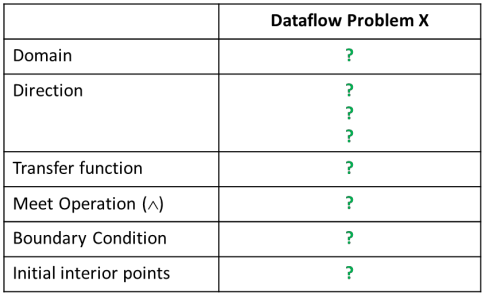
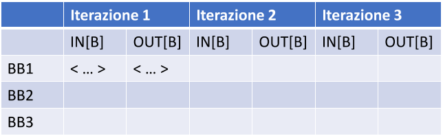

# Compilers Assignments
## Assignment 1
Implementare tre passi LLVM (dentro lo stesso passo LocalOpts già scritto durante il LAB 2) che realizzano le seguenti ottimizzazioni locali:
 
 1. Algebraic Identity
    - $x + 0 = 0 + x \Rightarrow x$
    - $x \times 1 = 1 \times x \Rightarrow x$

 2. Strength Reduction (più avanzato)
    - $15 \times x = x \times 15 \Rightarrow (x << 4) – x$
    - $y = x / 8 ⇒ y = x >> 3$

 3. Multi-Instruction Optimization	
    - $a = b + 1, c = a − 1 ⇒ a = b + 1, c = b$

## Assignment 2
Consideriamo i seguenti problemi di Dataflow Analysis:
 - Very Busy Expressions 
 - Dominator Analysis
 - Constant Propagation

Per ognuno di essi…
 1. Derivare una formalizzazione riempiendo lo specchietto coi parametri adeguati

 

 2. Per il CFG di esempio fornito, popolare una tabella con le iterazioni dell’algoritmo iterativo di soluzione del problema

 
